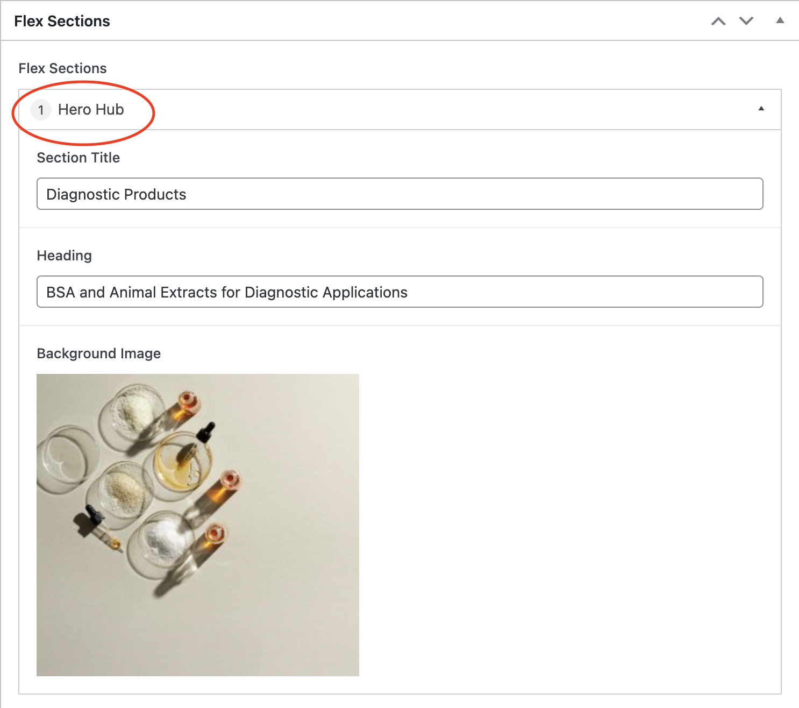

# About Flex Sections

Happy Medium uses a feature called Flexible Content or just simply "Flex" to give the user more flexible control over how the patterns and page templates in the site design can be implemented within the CMS to create a unique and dynamic page structure.

The Flex Sections field provides a simple, structured, block-based editor.

Using layouts and sub fields to design the available blocks, this field type acts as a blank canvas to which you can define, create and manage content with total control.

Each page template in Wordpress will have an available "Flex Section" that will contain a number of content blocks or "patterns" that can be used to create a unique layout of content on each page.

To get started, create a new Page and look for the "Flex Sections" panel on the page editor layout. You will see an empty area with the words "Click the "Add Section" button below to start creating your layout" or if there is already existing content in this Flex Section then simply click "Add Section" to add new content.

Depending on your website's design and configuration you may see different content options than what is shown in the reference screenshot, however, this should include a variety all content patterns including items such as a Hero Image, Multi CTA, Resources, or other similar featured content.

All patterns in the Flex Sections will have a very simple interface that only requires you to insert copy, images, and links without worrying about managing the styles, layout or maintaining the brand guidelines. Once the content has been entered and the page updated the content you have just entered will be put into the appropriate places within the patterns.

A few of the Flex Section patterns make use of a featured image which can be uploaded or chosen from the Media Library. The Flex Section patterns may have other options or configurations available in addition to use of the standard built-in Wordpress word processing WYSIWYG Editor.

The Flex patterns that allow multiple instances of an object or call-to-action will display an additional "Add "¦" button that will allow you to add another instance of that content block. There is also a "minus" (-) symbol and "copy" symbol that will allow you to remove or duplicate a certain piece of content, respectively.

https://www.advancedcustomfields.com/resources/flexible-content/