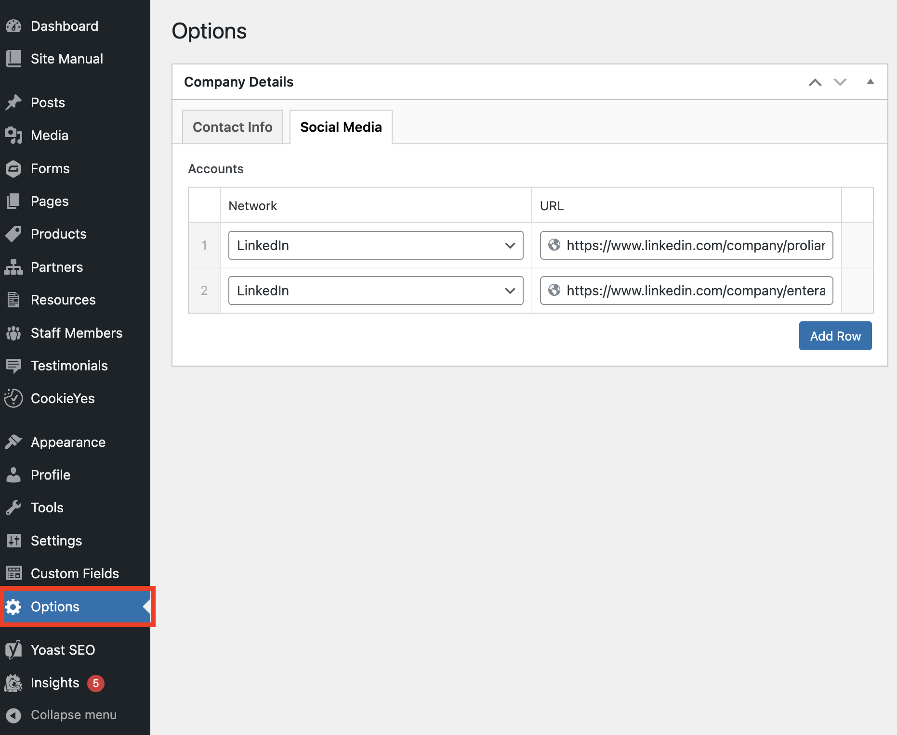

# Global Options

Wordpress websites developed by Happy Medium typically contain a fair amount of customization and features that are unique to each client and the custom theme that we have developed for Wordpress. There will often be some settings or content areas that don't apply to a specific page, but do affect the site in a more broad global application or will be repeated by a specific pattern that we built intended to be used on multiple pages throughout the site. These options will typically be defined in the "Options" page of the CMS.

You can find the "Options" page by looking towards the bottom of the main WP Toolbar when logged into the CMS.

